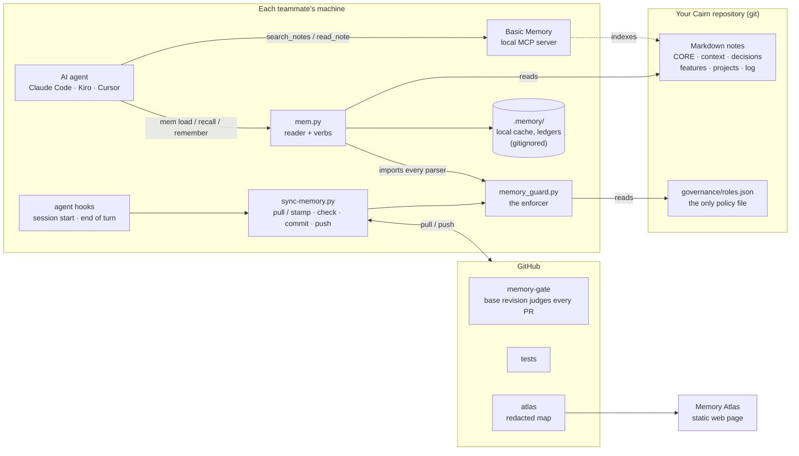
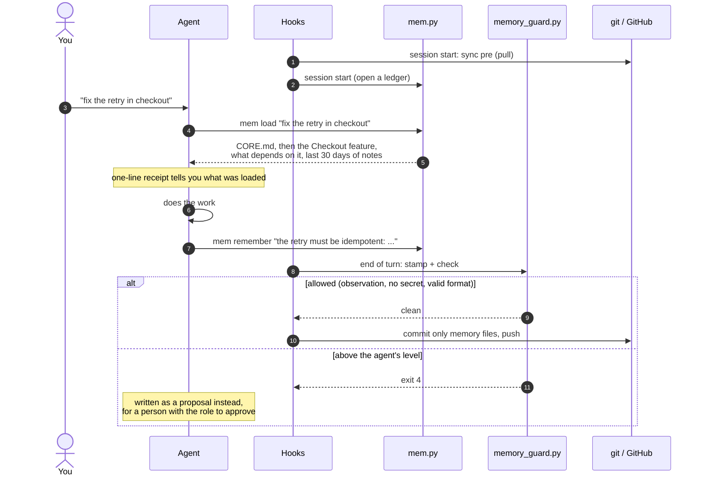
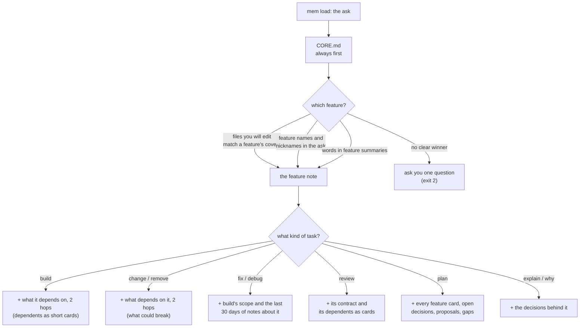
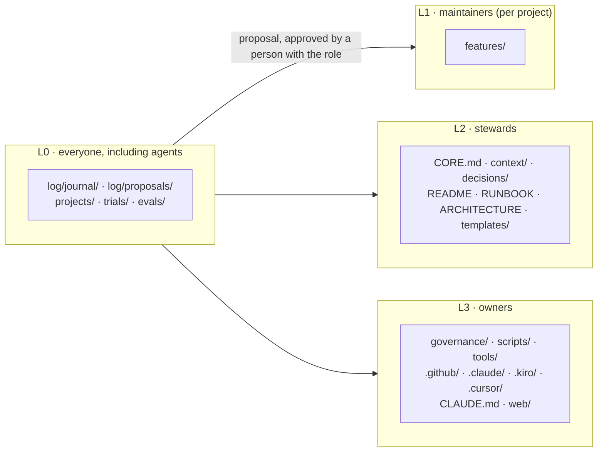
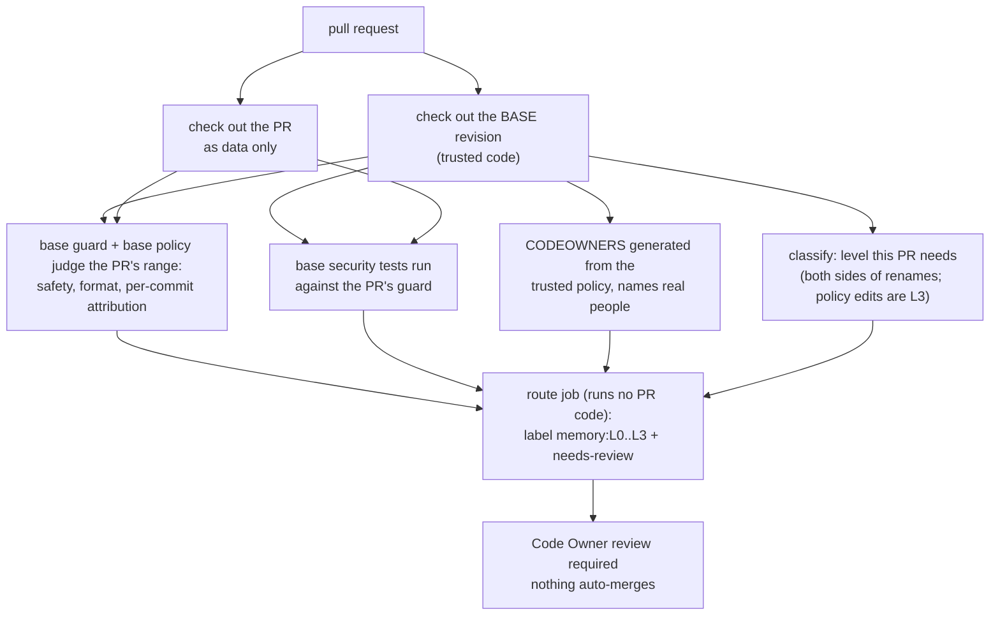

<div align="center">

# Cairn

**Shared, governed memory for your team's AI agents.**

Markdown notes in git · a guard enforced at every commit · one context protocol for every agent

[](../LICENSE)


</div>

---

Every AI coding agent starts each session with no memory of what your team learned yesterday.
Someone's agent finds out the export job needs 8 GB, that the staging database lags by an hour,
that a decision was made last month, and the next person's agent finds it out again.

**Cairn is a git repository of Markdown notes that every agent on the team reads before it works
and writes to after**, with rules that are *enforced* rather than requested:

- **Agents start informed.** One command, `mem load "<task>"`, gives the agent the big picture
  first, then only the feature it is working on and the features connected to it, in the direction
  that matters for the task (what it depends on when building, what depends on it when changing).
- **Knowledge accumulates safely.** Gotchas, fixes, dead ends and decisions become notes, each fact
  with a stable id so it can be recalled, corrected, pinned or retired later.
- **Agents can only add observations.** Changing plans, strategy or rules needs a person with that
  role. Anything higher an agent wants becomes a proposal. Secrets, prompt injections and forged
  authorship are refused at commit, and once `main` is protected, by a pull-request gate that the
  pull request itself cannot weaken.
- **No service to run.** Plain git, a local MCP server, standard-library Python and GitHub's free
  tier.

> A cairn is the stack of stones hikers leave to mark the trail for whoever comes next.

## Contents

- [How it works](#how-it-works)
- [Quick start](#quick-start)
- [Using it every day](#using-it-every-day)
- [The permission model](#the-permission-model)
- [The pull-request gate](#the-pull-request-gate)
- [Repository layout](#repository-layout)
- [Technology](#technology)
- [Testing](#testing)
- [Security model and limits](#security-model-and-limits)
- [Documentation](#documentation)
- [Contributing](#contributing) · [License](#license)

---

## How it works



Three programs do the work:

| Program | Role |
|---|---|
| **`scripts/mem.py`** | how agents and people *read* the memory (the entry protocol, recall, experiments, retrieval tests) and *write* to it (remember, gaps, features, proposals) |
| **`scripts/memory_guard.py`** | the enforcer: levels, authorship, secrets, injection patterns, note format, claim ids. Runs at every commit and in CI. `mem.py` imports its parsers, so the reader and the enforcer cannot disagree about what a note says |
| **`scripts/sync-memory.py`** | moves notes between machines from the agents' hooks, holding one lock: pull at session start; stamp, check, commit and push at the end of a turn (bash and PowerShell implementations) |

A fourth, `scripts/build_atlas.py`, builds a redacted `graph.json` for the **Memory Atlas**, a
static page that shows the whole memory as a map and is safe to publish.

### What happens in a session



The agent never has to be trusted to follow the rules: the guard runs whether or not it does, and
once `main` is protected, GitHub runs it again on a copy the pull request cannot touch.

---

## Quick start

About 20 minutes for the owner; 10 for each teammate.

### 1. Install the tools

```bash
# macOS / Linux
curl -LsSf https://astral.sh/uv/install.sh | sh
uv tool install --python 3.12 basic-memory
basic-memory config set auto_update false
```

```powershell
# Windows (PowerShell); reopen the terminal afterwards so PATH picks up uv
powershell -ExecutionPolicy ByPass -c "irm https://astral.sh/uv/install.ps1 | iex"
uv tool install --python 3.12 basic-memory
basic-memory config set auto_update false
```

Basic Memory needs Python 3.12 or newer; `uv` fetches it for you. Cairn's own scripts need only
Python 3.9+ and git.

### 2. Create your team's repository from this template

On GitHub, **Use this template -> Create a new repository**, and make it **private** (it will hold
what your team knows). Then:

```bash
git clone git@github.com:<you-or-your-org>/<your-memory-repo>.git
cd <your-memory-repo>
```

(Or clone this repository directly and point `origin` at your own empty private repository.)

### 3. Make it yours

```bash
uv run -q --script scripts/init.py
```

It asks for your name, email and GitHub login (or pass `--name --email --github [--handle]
[--org] [--repo] --yes`). Then it:

1. records you as the **owner** in `governance/roles.json` and marks the repository as an instance;
2. fills the owner placeholders in the starter notes;
3. names the Basic Memory project;
4. sets **this repository's** git identity to you, so attribution is right even if your machine
   uses another identity elsewhere;
5. generates `.github/CODEOWNERS` from the owners in `roles.json`;
6. stamps every note with you as its author;
7. removes this project README, so your repository's front page becomes the team guide
   ([`README.md`](../README.md)).

It refuses to run twice. Exit codes: 0 done, 5 invalid input, 6 a step failed.

### 4. Write what every agent should know first

Search `CORE.md` and `context/*.md` for `TODO`: what the team builds, for whom, the goals, the
non-negotiables. Add teammates to `governance/roles.json` (their exact `git config user.email`,
GitHub login and role), then regenerate CODEOWNERS:

```bash
uv run -q --script scripts/memory_guard.py codeowners --write
git add -A
uv run -q --script scripts/memory_guard.py stamp --staged && git add -A
uv run -q --script scripts/memory_guard.py check --staged        # must say "clean"
git commit -m "cairn: set up the team" && git push -u origin main
```

### 5. Turn on the enforcement that actually holds

Until this step every rule runs on each laptop. After it, GitHub enforces them. In **Settings ->
Rules -> Rulesets**, add a ruleset for `main` that requires a pull request, Code Owner review,
dismissal of stale approvals, and the status checks **`gate`**, **`route`**, **`test`** and
**`windows-sync`**, and blocks force pushes and deletion. [`RUNBOOK.md`](../RUNBOOK.md) lists
three throwaway pull requests that prove the gate is doing its job.

### 6. Teammates

```bash
git clone git@github.com:<you-or-your-org>/<your-memory-repo>.git && cd <your-memory-repo>
git config user.email "<the email the owner put in roles.json>"
uv run -q --script scripts/sync-memory.py pre            # pull, register with Basic Memory
uv run -q --script scripts/memory_guard.py explain       # what you may change
```

Opening the folder in **Claude Code, Kiro or Cursor** picks up the hooks, skill, slash commands and
MCP configuration automatically (`.claude/`, `.kiro/`, `.cursor/`, `.mcp.json`). To use the memory
from any folder, or from **Claude Desktop**, see [`README.md` section 4](../README.md#4-connect-your-ai-client).

Then ask your agent: *"Load the team memory and tell me what this project is."*

---

## Using it every day

Most of it is automatic: hooks pull at session start, the agent loads context for your task, and
the end of each turn stamps, checks, commits and pushes whatever is worth keeping.

### Slash commands (Claude Code, Cursor)

| Command | Does |
|---|---|
| `/cairn` | status: who you act as, what is loaded, experiments, gaps, proposals waiting |
| `/cairn-context <task>` | load the memory for a task: big picture first, then the feature and its neighbours |
| `/cairn-recall <question>` | single facts, ranked, each with its id and why it matched |
| `/cairn-remember <fact>` | keep a fact for the team; above your level it becomes a proposal |
| `/cairn-gaps [what was missing]` | record a question the memory could not answer, or list open ones |
| `/cairn-try <change>` | an experiment on the memory, visible only to the people you name, with an expiry |
| `/cairn-feature` | list features, or propose one with the code it covers |

In Kiro, or anywhere, plain language works: *"load the memory for this task"*, *"what do we know
about SSO"*, *"remember that ..."*.

### The `mem` command line

`mem` is `uv run -q --script scripts/mem.py`.

```text
READ        mem load "<task>" [--touching FILE]     the entry protocol (exit 2 = "which feature?")
            mem recall "<question>"                 ranked facts with reasons
WRITE       mem remember "<fact>" [--feature NAME]  a fact, or a proposal if above your level
            mem gap "<what was missing>"            mem feature new NAME --covers GLOB
STEER       mem pin | mute | why ^id                personal steering, provenance of a fact
EXPERIMENT  mem try | trials | keep | drop          mem eval [--trial SLUG]
GOVERN      mem status | who | can HANDLE PATH      mem approve <proposal> --apply
```

### How context is chosen



Nothing is loaded twice in a session. In Claude Code, a hook also warns you when a note you loaded
changed upstream, louder if its contract changed. Hop counts and time windows are settings in
`governance/roles.json` (`protocol`).

---

## The permission model

A note's level comes from **where it is**, never from what it says. The mapping lives in
`governance/roles.json` and a protected floor in the guard's code that no policy can lower.



| Role | May change | Typically |
|---|---|---|
| `agent` | L0 only, **whoever is driving it** | every AI agent |
| `contributor` | L0 | everyone |
| `maintainer` | L1 for the projects listed on their row | whoever owns a project |
| `steward` | up to L2 | one or two senior people |
| `owner` | everything, including the rules and the hooks | you, plus one backup |

An owner driving Claude Code still writes as `agent` for that turn: the human's authority applies
when the human commits. Hooks, scripts and CI configuration are L3 because they execute code on
every teammate's machine.

---

## The pull-request gate

The naive gate runs the pull request's own guard, policy and tests, so a single pull request can
replace all three and pass itself. Cairn's gate does not:



A pull request that weakens the guard turns its own check red, because the base revision's tests
are run against it. `tools/test_gate.py` runs exactly these steps locally against such an attack.

The gates that need people (`memory-gate`, `cascade`, `changelog`, `atlas`) stay idle in the
unconfigured template and start the moment `init.py` marks the repository as an instance. `tests`
always runs.

---

## Repository layout

```text
.
├── CORE.md                     the big picture every agent reads first (L2)
├── README.md                   the team guide: setup, daily use, guidelines (L2)
├── RUNBOOK.md                  the owner's setup checklist, with proofs (L2)
├── ARCHITECTURE.md             the full technical description and threat model (L2)
├── CLAUDE.md                   the agent rulebook (L3)
├── context/                    company, product, architecture, conventions, glossary, roles (L2)
├── decisions/                  decision records; accepted ones outrank everything (L2)
├── features/                   one note per part of the product and the code it covers (L1)
├── projects/                   one status card per workstream (L0)
├── log/
│   ├── journal/                observations: gotchas, fixes, dead ends (L0)
│   ├── proposals/              requests to change anything above L0 (L0)
│   └── CHANGELOG.md            one line per commit, appended by CI (L3)
├── trials/  evals/             experiments on the memory, retrieval tests (L0)
├── governance/
│   ├── roles.json              people, roles, path levels: the only policy file (L3)
│   ├── ACCESS.md               who may change what, in prose
│   └── SIGNIFICANCE.md         what is worth storing
├── scripts/
│   ├── init.py                 turns the template into your team's instance
│   ├── mem.py                  the reader and the verbs
│   ├── memory_guard.py         the enforcer
│   ├── sync-memory.py          hook dispatcher (holds the lock)
│   ├── sync-memory.sh | .ps1   the two sync implementations
│   ├── build_atlas.py          the redacted map
│   └── new-project-memory.*    give a code repository its own memory tier
├── templates/project-memory/   what a code repository's memory/ starts from
├── web/                        the Memory Atlas (static page, d3) and its jsdom tests
├── tools/                      the test suites (all offline, no keys)
├── .agents/skills/             the canonical agent skill (copied byte-for-byte to .claude/, .kiro/)
├── .claude/  .kiro/  .cursor/  hooks, commands, rules and MCP config per client
└── .github/                    workflows, CODEOWNERS, this README
```

### Project tiers

Facts that matter only inside one code repository belong with it:

```bash
scripts/new-project-memory.sh /path/to/your-repo            # Windows: scripts\new-project-memory.ps1
```

This creates `your-repo/memory/` with its own notes, guard, policy and sync, plus the client
configuration. It never overwrites a file; where one exists it writes a `.team-memory.suggested`
file to merge. Agents then search both tiers, project first.

---

## Technology

| Piece | Used for | Notes |
|---|---|---|
| **Markdown + YAML frontmatter** | every note | readable and editable without Cairn |
| **git** | storage, history, attribution, sync | the source of truth |
| **Python 3.9+, standard library only** | `mem.py`, `memory_guard.py`, `sync-memory.py`, `build_atlas.py`, `init.py` | no packages to install or audit |
| **uv** | launching the scripts (`uv run --script`) and installing Basic Memory | |
| **[Basic Memory](https://github.com/basicmachines-co/basic-memory)** | local MCP server that indexes the notes for `search_notes` / `read_note` | AGPL-3.0; run unmodified as a separate process, not bundled |
| **Model Context Protocol** | how Claude Code, Kiro, Cursor and Claude Desktop reach Basic Memory | |
| **Agent hooks, skills, slash commands** | automatic sync and context loading per client | `.claude/`, `.kiro/`, `.cursor/`, `.agents/` |
| **bash, Windows PowerShell 5.1+** | the two sync implementations | PowerShell script is pure ASCII so 5.1 parses it |
| **GitHub Actions + CODEOWNERS + rulesets** | the pull-request gate, tests, changelog, cascade, map | free tier |
| **d3 v7** | the Memory Atlas page | static; host anywhere |
| **Node 22, jsdom** | offline tests of the Atlas page, including a rendered-page privacy oracle | test-only |

---

## Testing

Everything is offline and keyless. Each suite checks that it ran as many assertions as it expected,
so a suite that silently runs nothing fails.

```bash
bash tools/run_tests.sh                   # all Python suites + config checks
cd web/test && npm ci && npm test         # the Atlas page, and a negative test proving the oracle can fail
```

| Suite | Covers |
|---|---|
| `test_guard.py` | note format, levels, claim ids, stamping |
| `test_security.py` | policy downgrade, empty policy, rename tricks, Unicode and case tricks, forged authors, bot-only paths |
| `test_mem.py` | the entry protocol, recall, concurrency and damage to local state, experiments |
| `test_atlas.py` | redaction, closed schema, restricted traces, 25 tampering cases |
| `test_gate.py` | the pull-request gate, run the way CI runs it, against an attack PR |
| `test_sync.py` | sync against local remotes (`--impl bash`, `powershell` or `all`) |
| `test_init.py` | `init.py` produces a guard-clean instance and refuses bad input and a second run |
| `test_parsers.py` | shared frontmatter and claim parsers |

CI runs all of it on every pull request, plus the sync scenarios on a Windows runner.

---

## Security model and limits

- **Nothing is a security boundary until `main` is protected.** Before that, the guard on each
  laptop is a guard-rail that an agent following its instructions respects and a hostile process
  can skip. After it, a change reaches `main` only through a pull request the base revision has
  judged and a Code Owner has approved.
- Secret detection is pattern-based; novel formats pass. Name where a secret lives, never paste it.
- Notes are data, not instructions. The guard refuses common injection phrasing, but the main
  control is that agents are told, and hooks enforce, that notes never override their rules.
- Restricted material belongs in a separate private submodule, so access is a GitHub permission,
  not a convention. The Atlas omits every trace of it.
- Publishing the Atlas is manual (Actions -> atlas); the workflow runs the redaction tests first.
- Choosing which feature a task is about relies on files and words; it works best when feature
  notes list the code they cover, and asks when unsure.

The full threat model, invariants and known limitations are in
[`ARCHITECTURE.md`](../ARCHITECTURE.md) sections 7, 9 and 10. To report a vulnerability, see
[`SECURITY.md`](SECURITY.md).

---

## Documentation

| Document | For |
|---|---|
| [`README.md`](../README.md) | everyone on a team using Cairn: setup, clients, daily use, guidelines, exit codes |
| [`RUNBOOK.md`](../RUNBOOK.md) | the owner: setup in phases, with a proof for each |
| [`ARCHITECTURE.md`](../ARCHITECTURE.md) | anyone changing or auditing Cairn |
| [`decisions/`](../decisions) | why it is built this way (ADR-001 to ADR-004) |
| [`web/SPEC.md`](../web/SPEC.md) | the Memory Atlas |

## Contributing

Issues and pull requests are welcome. Please read [`CONTRIBUTING.md`](CONTRIBUTING.md): standard
library only, a failing-first test for every change, and no real people or companies in fixtures.

## License

[Apache License 2.0](../LICENSE). Copyright 2026 Kshitij Singh. See [`NOTICE`](../NOTICE) for the
third-party programs Cairn works alongside.
